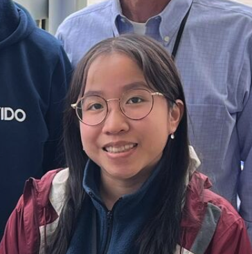

--- 
title: "Introduction to R 2025"
author: "Faculty: Mohamed Helmy"
date: "October 6-7, 2025"
site: bookdown::bookdown_site
documentclass: book
bibliography: [book.bib, packages.bib]
url: https://bioinformaticsdotca.github.io/INR_Sask-2510/ 
cover-image: img/bioinformatics_logo.png
description: |
  Workshop website for the 2025 Introduction to R Canadian Bioinformatics Workshop
link-citations: yes
github-repo: bioinformaticsdotca/INR_Sask-2510
favicon: img/favicon.ico
---

# (PART) Introduction {-}

# Workshop Info

Welcome to the 2025 Introduction to R Canadian Bioinformatics Workshop webpage!  

## Pre-work

[You can find your pre-work here.](https://docs.google.com/forms/d/e/1FAIpQLSeJxCyYGuRbbbmOsibx7BnSH3F1SY_IheVu5ira-5uoDMZ_xA/viewform?usp=dialog)

## Class Photo

<iframe src="https://drive.google.com/file/d/1ZsjwVWnPj4Ct9IUFpV2OBn3KyED9ZS46/preview" width="640" height="480" allow="autoplay"></iframe>

## Schedule

```{r schedule-loader, echo=FALSE, message=FALSE, warning=FALSE}
# --- Self-Contained R-Markdown Schedule Component ---
# To format your schedule csv, go here: https://cbw-dev.github.io/smart-scheduler/

# 1. Load necessary libraries
library(readr)
library(jsonlite)
library(htmltools)

# 2. Define the path to your schedule data
csv_path <- "schedule.csv"

# 3. Check if the CSV file exists
if (!file.exists(csv_path)) {
  stop("Error: 'schedule.csv' not found. Please create it in your project directory.")
}

# 4. Read the schedule data, ensuring all columns are character type
schedule_df <- readr::read_csv(
  csv_path,
  col_types = cols(.default = "c"),
  show_col_types = FALSE
)

# 5. Convert the data frame to a JSON object
schedule_json <- jsonlite::toJSON(schedule_df, auto_unbox = FALSE, na = "string")

# 6. Define the HTML structure, CSS, and JavaScript using htmltools
schedule_component <- tagList(
  # A. CSS for the design
  tags$style(HTML("
    :root {
      --schedule-primary-color: #4A6BFF;
      --schedule-border-color: #EAECEF;
      --schedule-text-color: #555;
    }
    .schedule-card {
      font-family: -apple-system, BlinkMacSystemFont, 'Segoe UI', Roboto, Oxygen, Ubuntu, Cantarell, 'Open Sans', 'Helvetica Neue', sans-serif;
      border: 1px solid var(--schedule-border-color);
      border-radius: 12px;
      margin: 2em 0;
      box-shadow: 0 4px 12px rgba(0,0,0,0.05);
      overflow: hidden;
    }
    .schedule-tabs {
      display: flex;
      justify-content: space-between;
      align-items: center;
      border-bottom: 1px solid var(--schedule-border-color);
      background-color: #fff;
    }
    .schedule-tabs-wrapper {
      position: relative;
      flex-grow: 1;
      overflow: hidden;
    }
    .schedule-tabs-wrapper::before,
    .schedule-tabs-wrapper::after {
      content: '';
      position: absolute;
      top: 0;
      bottom: 0;
      width: 50px;
      pointer-events: none;
      transition: opacity 0.2s;
      opacity: 0;
    }
    .schedule-tabs-wrapper::before {
      left: 0;
      background: linear-gradient(to left, rgba(255,255,255,0), #fff 70%);
    }
    .schedule-tabs-wrapper::after {
      right: 0;
      background: linear-gradient(to right, rgba(255,255,255,0), #fff 70%);
    }
    .schedule-tabs-wrapper.scrolled-left::before { opacity: 1; }
    .schedule-tabs-wrapper.scrolled-right::after { opacity: 1; }
    
    .schedule-tab-buttons {
      display: flex;
      overflow-x: auto;
      white-space: nowrap;
      -ms-overflow-style: none;
      scrollbar-width: none;
      scroll-behavior: smooth;
    }
    .schedule-tab-buttons::-webkit-scrollbar { display: none; }
    
    .timezone-selector-container {
      display: flex;
      align-items: center;
      gap: 0.75em;
      padding: 0 20px;
    }
    .timezone-selector-container label {
      font-size: 0.9em;
      color: var(--schedule-text-color);
      font-weight: 500;
    }
    .schedule-tabs select {
      padding: 6px 10px;
      border-radius: 6px;
      border: 1px solid #ccc;
      background-color: #fff;
    }
    .schedule-tab {
      padding: 14px 20px;
      cursor: pointer;
      border-bottom: 3px solid transparent;
      margin-bottom: -1px;
      color: var(--schedule-text-color);
      font-weight: 500;
    }
    .schedule-tab.active {
      color: var(--schedule-primary-color);
      border-bottom-color: var(--schedule-primary-color);
    }
    .schedule-panel { display: none; }
    .schedule-panel.active { display: block; }
    .schedule-table { width: 100%; border-collapse: collapse; }
    .schedule-table th, .schedule-table td {
      text-align: left;
      padding: 14px 20px;
      border-bottom: 1px solid var(--schedule-border-color);
    }
    .schedule-table th {
      color: #888;
      font-size: 0.8em;
      font-weight: 600;
      text-transform: uppercase;
      background-color: #F8F9FA;
    }
    .schedule-table tr:last-child td { border-bottom: none; }
    
    /* --- RULE FOR BREAKS AND PAUSES --- */
    .schedule-table tr.is-break td {
      font-style: italic;
      font-size: 0.95em;
      color: #777;
    }
    
    /* --- NEW: RULE FOR 'OTHER' TYPE (More Visible) --- */
    .schedule-table tr.is-other td {
      background-color: #f0f4ff; /* A light blue background */
      font-weight: 500; /* Slightly bolder text */
    }
    .schedule-table tr.is-other td:first-child {
      border-left: 4px solid var(--schedule-primary-color);
    }
  ")),

  # B. HTML placeholders
  div(class = "schedule-card",
      div(class = "schedule-tabs", id = "schedule-tabs-container"),
      div(class = "schedule-content", id = "schedule-panels-container")
  ),

  # C. JavaScript to build the interface
  tags$script(HTML(paste0('
    document.addEventListener("DOMContentLoaded", function() {
      const scheduleData = ', jsonlite::toJSON(schedule_df, auto_unbox = TRUE, na = "string"), ';
      const tabsContainer = document.getElementById("schedule-tabs-container");
      const panelsContainer = document.getElementById("schedule-panels-container");

      if (scheduleData.length === 0) return;

      const timezones = [];
      const firstRow = scheduleData[0];
      for (const key in firstRow) {
        if (key.match(/timezone_\\d+_label/)) {
          const index = key.match(/\\d+/)[0];
          timezones.push({ index: index, label: firstRow[key] });
        }
      }
      const days = [...new Set(scheduleData.map(row => row.day_label))];
      
      const tabsWrapper = document.createElement("div");
      tabsWrapper.className = "schedule-tabs-wrapper";
      const tabButtonsContainer = document.createElement("div");
      tabButtonsContainer.className = "schedule-tab-buttons";
      tabsWrapper.appendChild(tabButtonsContainer);
      tabsContainer.appendChild(tabsWrapper);

      days.forEach((day, dayIndex) => {
        const tab = document.createElement("div");
        tab.className = "schedule-tab";
        tab.dataset.target = `panel-${dayIndex}`;
        tab.textContent = day;
        tabButtonsContainer.appendChild(tab);
      });

      if (timezones.length > 1) {
        const selectorContainer = document.createElement("div");
        selectorContainer.className = "timezone-selector-container";
        let selectorHtml = `<label for="tz-selector">Timezone</label>
                            <select id="tz-selector">`;
        timezones.forEach(tz => {
          selectorHtml += `<option value="${tz.index}">${tz.label}</option>`;
        });
        selectorHtml += `</select>`;
        selectorContainer.innerHTML = selectorHtml;
        tabsContainer.appendChild(selectorContainer);
      }
      
      const tzSelector = document.getElementById("tz-selector");

      days.forEach((day, dayIndex) => {
        panelsContainer.innerHTML += `<div class="schedule-panel" id="panel-${dayIndex}"></div>`;
      });
      
      const tabs = document.querySelectorAll(".schedule-tab");
      const panels = document.querySelectorAll(".schedule-panel");

      function renderTables() {
        const selectedTzIndex = tzSelector ? tzSelector.value : timezones[0].index;
        const timeCol = `time_${selectedTzIndex}`;
        let selectedTzLabel = tzSelector ? tzSelector.options[tzSelector.selectedIndex].text : timezones[0].label;
        
        panels.forEach((panel, dayIndex) => {
          const day = days[dayIndex];
          const dayEvents = scheduleData.filter(row => row.day_label === day);
          let tableHtml = `<table class="schedule-table"><thead><tr>
                               <th style="width:25%;">${selectedTzLabel}</th>
                               <th>Activity</th>
                               </tr></thead><tbody>`;
          dayEvents.forEach(row => {
            const type = row.type ? row.type.toLowerCase() : "";
            let rowClass = "";

            if (type === "break" || type === "pause") {
              rowClass = "class=\'is-break\'";
            } else if (type === "other") {
              rowClass = "class=\'is-other\'";
            }
            
            tableHtml += `<tr ${rowClass}><td>${row[timeCol] || ""}</td><td>${row.activity || ""}</td></tr>`;
          });
          tableHtml += `</tbody></table>`;
          panel.innerHTML = tableHtml;
        });
      }

      function switchTab(targetId) {
        tabs.forEach(tab => tab.classList.remove("active"));
        panels.forEach(panel => panel.classList.remove("active"));
        
        const activeTab = document.querySelector(`[data-target=\'${targetId}\']`);
        const activePanel = document.getElementById(targetId);
        
        if (activeTab) {
          activeTab.classList.add("active");
          activeTab.scrollIntoView({ behavior: "smooth", block: "nearest", inline: "center" });
        }
        if (activePanel) {
          activePanel.classList.add("active");
        }
      }
      
      function updateScrollIndicators() {
        const el = tabButtonsContainer;
        const scrollLeft = Math.round(el.scrollLeft);
        const scrollWidth = Math.round(el.scrollWidth);
        const clientWidth = Math.round(el.clientWidth);
        
        const hasOverflow = scrollWidth > clientWidth;
        tabsWrapper.classList.toggle("scrolled-left", hasOverflow && scrollLeft > 0);
        const isAtEnd = scrollLeft >= scrollWidth - clientWidth;
        tabsWrapper.classList.toggle("scrolled-right", hasOverflow && !isAtEnd);
      }

      tabButtonsContainer.addEventListener("click", e => {
        if (e.target.classList.contains("schedule-tab")) {
          switchTab(e.target.dataset.target);
        }
      });

      if (tzSelector) {
        tzSelector.addEventListener("change", renderTables);
      }
      
      tabButtonsContainer.addEventListener("scroll", updateScrollIndicators, { passive: true });
      window.addEventListener("resize", updateScrollIndicators);

      renderTables();

      // --- LOGIC TO ACTIVATE CURRENT DAY ---
      let initialTabIndex = 0;

      const today = new Date();
      const monthNames = ["January", "February", "March", "April", "May", "June", "July", "August", "September", "October", "November", "December"];
      const monthName = monthNames[today.getMonth()];
      const day = today.getDate();
      const year = today.getFullYear();
      const todayString = `${monthName} ${day}, ${year}`;

      const todayEvent = scheduleData.find(row => row.date === todayString);

      if (todayEvent) {
        const dayIndex = days.findIndex(day => day === todayEvent.day_label);
        if (dayIndex !== -1) {
          initialTabIndex = dayIndex;
        }
      }

      if (tabs.length > initialTabIndex) {
        const initialTabId = `panel-${initialTabIndex}`;
        switchTab(initialTabId);
      }
      // --- END OF CURRENT DAY LOGIC ---

      setTimeout(updateScrollIndicators, 100);
    });
  ')))
)

# 7. Output the final component
schedule_component
```

<!--chapter:end:index.Rmd-->

# Meet Your Faculty

<!--#### NAME


>JOB TITLE <br>
INSTITUTION <br>
LOCATION
>
> --- CONTACT INFO, IF PROVIDED

BIO GOES HERE-->

#### Mohamed Helmy


Principal Scientist and Adjunct Professor <br>
Vaccine and Infectious Disease Organization (VIDO), University of Saskatchewan <br>
Saskatoon, Saskatchewan, Canada

mohamed.helmy@usask.ca

Mohamed is a Computational Systems Biologist and Principal Scientist leading the Bioinformatics and Systems Biology Lab (BSBL) at the Vaccine and Infectious Disease Organization (VIDO), University of Saskatchewan. He received his MSc and PhD in Computational Systems Biology from Keio University (Tokyo, Japan) and completed his postdoctoral training in bioinformatics at Kyoto University and the University of Toronto. Mohamed’s interdisciplinary research profile bridges biology, computer science, and public health.


#### Sylvia Li



Graduate student <br>
Vaccine and Infectious Disease Organization (VIDO), University of Saskatchewan <br>
Saskatoon, Saskatchewan, Canada

Sylvia is a Computer science MSc student at the University of Saskatchewan, supervised by Dr. Helmy. She holds dual BSc degrees in Bioinformatics and Computer science. Currently her work focuses on bacterial genomic data.

<!--chapter:end:001-faculty.Rmd-->

<!--
IF YOUR WORKSHOP DOES NOT INCLUDE COMPUTE:
- REMOVE "AND COMPUTE SETUP" FROM THE TOP-LEVEL HEADER
- DELETE THE LAST SECTION (COMPUTE SETUP)

IF YOUR WORKSHOP INCLUDES COMPUTE:
- AFTER THE WORKSHOP, ADD DATA DOWNLOAD LINKS, AWS MACHINE IMAGE INSTRUCTIONS, ETC.
- IF IT IS MORE APPROPRIATE, YOU CAN INCLUDE THE DATA DOWNLOAD LINKS IN EACH OF THE MODULES.
-->

Data and Compute Setup

#### Course data downloads
Coming soon!

#### Compute setup
Coming soon!


<!--chapter:end:002-computing.Rmd-->

# (PART) Modules {-}

# Module 1

## Lecture


<!--<iframe width="640" height="360" src="YOUTUBE EMBED LINK" title="YouTube video player" frameborder="0" allow="accelerometer; autoplay; clipboard-write; encrypted-media; gyroscope; picture-in-picture; web-share" referrerpolicy="strict-origin-when-cross-origin" allowfullscreen></iframe>-->

### 1A
<iframe src="https://docs.google.com/presentation/d/1HQGHgFrZCr8yWmbz0R7lxYGiZpR_Xu_2/preview" width="640" height="480" allow="autoplay"></iframe>  

### 1B
<iframe src="https://docs.google.com/presentation/d/1U1PHHxf_9nJbht6ZWAm9-XpDARuTRPD5/preview" width="640" height="480" allow="autoplay"></iframe>  


## Lab 1A
### Variables
Create 2 numeric variables and assign values for each

```{r}
x = 10
y = 6
```

Calculate the sum of them

```{r}
total = x + y
total
```

Calculate the square root of the total
```{r}
sr = sqrt(total)
sr
```


### Data Structures 
Vector
```{r}
v <- c(1,2,3,4)
v
```


Matrix
```{r}
m <- matrix(1:6, nrow = 2)
m
```


Dataframe
```{r}
df <- data.frame(age=c(25,30), name=c("Mo","Tom"), group=c("A", "B"))
df
```

List
```{r}
lst <- list(numbers=v, info=df)
lst
```


### Install BioconductoR packages
```{r, eval=FALSE}
install.packages("BiocManager")
library(BiocManager)
BiocManager::install("ALL")
library("ALL")
data(ALL)
```
## Lab 1B

<!--chapter:end:010-module-1.Rmd-->

# Module 2

## Lecture


<!--<iframe width="640" height="360" src="YOUTUBE EMBED LINK" title="YouTube video player" frameborder="0" allow="accelerometer; autoplay; clipboard-write; encrypted-media; gyroscope; picture-in-picture; web-share" referrerpolicy="strict-origin-when-cross-origin" allowfullscreen></iframe>-->

### 2A
<iframe src="https://docs.google.com/presentation/d/1PzqDljdBka-mxb7osNcveBCvpzLRsKTS/preview" width="640" height="480" allow="autoplay"></iframe>  

### 2B
<iframe src="https://docs.google.com/presentation/d/1Dd5Dow29sairtG8tTLhsYChQV3qZGc5o/preview" width="640" height="480" allow="autoplay"></iframe>  
```{r}

```


## Lab 

<!--chapter:end:020-module-2.Rmd-->

# Module 3

## Lecture


<!--<iframe width="640" height="360" src="YOUTUBE EMBED LINK" title="YouTube video player" frameborder="0" allow="accelerometer; autoplay; clipboard-write; encrypted-media; gyroscope; picture-in-picture; web-share" referrerpolicy="strict-origin-when-cross-origin" allowfullscreen></iframe>-->

### 3A
<iframe src="https://docs.google.com/presentation/d/1raeb3J-YepwvImsSTPJV-kHCzo3H80ww/preview" width="640" height="480" allow="autoplay"></iframe>  

### 3B
<iframe src="https://docs.google.com/presentation/d/1NkVGkF-U1OgceFy-k06XUJ7az0Z2uS_Q/preview" width="640" height="480" allow="autoplay"></iframe>  


## Lab 

<!--chapter:end:030-module-3.Rmd-->

# Module 4

## Lecture


## Lab

<!--chapter:end:040-module-4.Rmd-->

